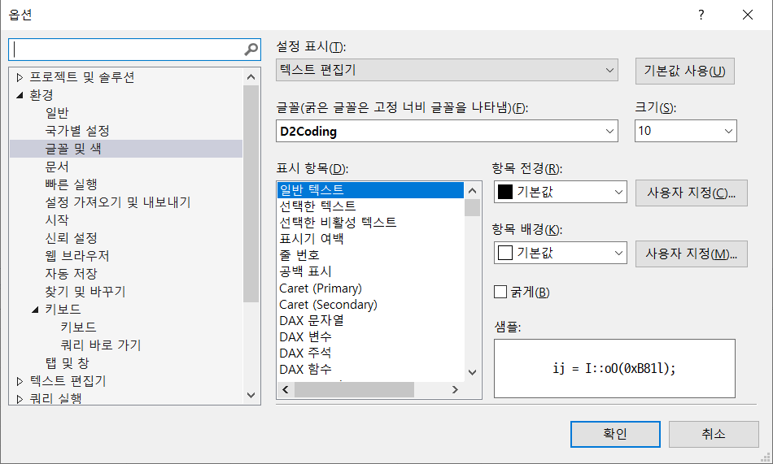

# SSMS 세팅 지원

***
## 1. SSMS 한글로 바꾸기
  점프서버는 영문OS라서 SSMS도 영문으로 깔았을 텐데 한글로 표시언어를 바꾸자.  
  SSMS실행 / Tools / Options / Environment / International Settings에  
  현재는 Same as Microsoft Windows로 되어 있다.  
  한국어를 선택하고 SSMS 재실행하면 한글로 바꿔있다.

* #### 1.1 한글 전환 문제
  sql을 작성중 다른 화면으로 이동했다 돌아오면 한글 상태로 자판이 자동 변경되는 문제가 있다.  
  15년 넘은 버그로 해결이 안되고 있다.  
  다음과 같이 임시 조치 가능  
    > 메뉴 / 쿼리 / 쿼리 옵션 창에서 영문으로 자판을 바꾸면 그 다음부터는 영문이 기본값.  

## 2. 코딩글꼴 D2로 바꾸기
  고정폭 글꼴을 지정하자. 한글에 가장 좋은 D2글꼴을 파일서버/설치파일/d2 에서 받아 설치하자  

  SSMS / 도구 / 옵션 / 환경 / 글꼴 및 색 에서 바꿀수 있다.  
  </img>
    

## 3. 단축키 사용하기
  특정한 쿼리 명령어를 사용자 단축키를 지정할수 있다.  
  SSMS / 도구 / 옵션 / 환경 / 키보드 / 쿼리 바로 가기 에서 지정하자

* a. 테이블 리스트 보기
> ctrl + 3 : SELECT * FROM INFORMATION_SCHEMA.TABLES ORDER BY TABLE_NAME

* b. 테이블명을 더블클릭으로 선택하고 실행하면 해당 테이블 컬럼리스트 보임
> ctrl + 4 : SP_COLUMNS

* c. 프로시저나 함수명을 선택하고 실행하면 소스가 보임.  
  단 결과가 표형태로 나와 불편한데 메뉴 / 쿼리 / 결과처리방법 / 표형태로 결과표시(Ctrl + T)으로 바꾸고 실행.  
> ctrl + 5 : SP_HELPTEXT

* d. 테이블명을 더블클릭으로 선택하고 실행하면 해당 테이블의 인덱스가 보임
> ctrl + 6 : SP_HELPINDEX 

## 4. SSMS 기본 캐릭터셋 바꾸기 (UTF-8 BOM)
  SQL 소스에 한글을 쓰면 저장할때마다 매번 적합하지 않은 캐릭터 셋이라고 하여 다른 인코딩으로 저장하도록 메시지가 뜰 수 있다.  
  아예 한글 지원 인코딩으로 SQL소스를 만들수 있게 템플릿을 수정하자.  

  다음 위치에 있는 SQLFile.sql 을 파일서버의 설치폴더/SSMS/SQLFile.sql 로 바꿔치기 한다.  
>  C:\Program Files (x86)\Microsoft SQL Server Management Studio 18\Common7\IDE\SqlWorkbenchProjectItems\Sql\SQLFile.sql